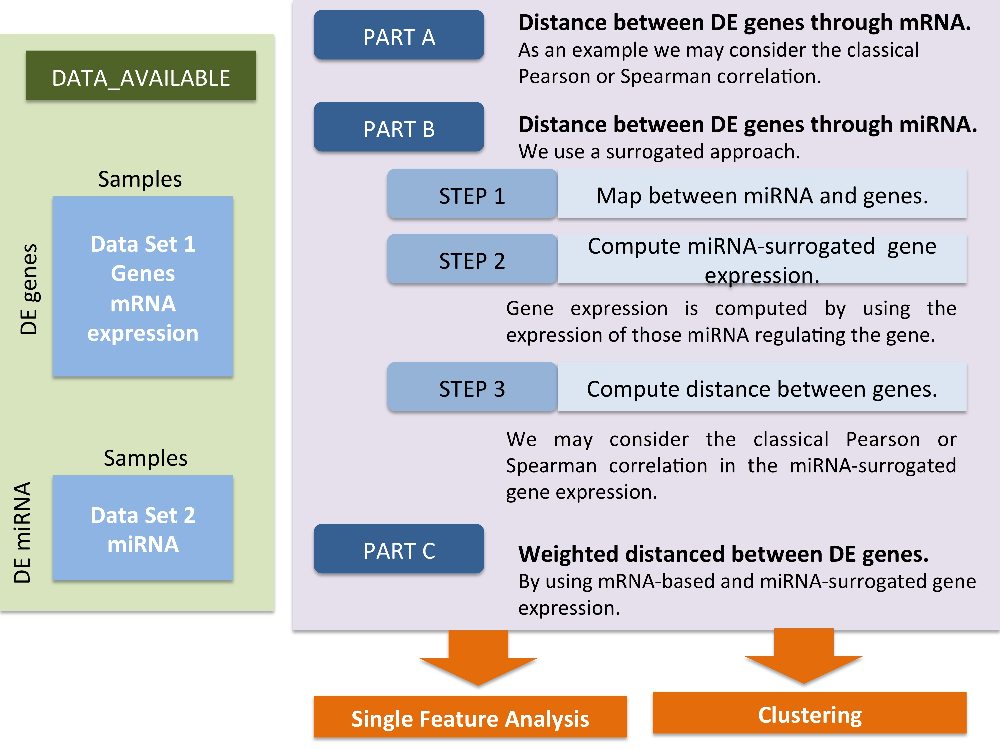

```{r, echo=F, message=F, results="asis"}
# this block is invisible
BiocStyle::markdown()
require(STATegRa)
require(Biobase)
require(gridExtra)
require(ggplot2)
g_legend<-function(a.gplot){
    tmp <- ggplot_gtable(ggplot_build(a.gplot))
    leg <- which(sapply(tmp$grobs, function(x) x$name) == "guide-box")
    legend <- tmp$grobs[[leg]]
    return(legend)}
```

# Introduction

Recent developments in high-throughput technologies for studying biological systems enables the researcher to simultaneously obtain several different types of data ("omics") over the course of an experiment. There exist many techniques for analysing the behaviour of these omics individually, but combining multiple classes of omics data can be used to give a better understanding of the biological system in question; the whole is greater than the sum of its parts. Integration of different types of omics data is an increasingly important technique for studying biological systems. 

The first step in this kind of integration analysis is to identify patterns in data shared by all the omics classes, and use these patterns to identify outliers. The most common techniques for this sort of analysis are clustering and principal components analysis.

The `STATegRa` package provides several different techniques for the evaluation of reproducibility among samples and across experimental conditions by combining the information contained multiple omics datasets. This is intended as a starting point for further integration analysis of any multi-omics dataset.

The `STATegRa` package implements two main utilities for this purpose: component analysis and clustering. 

[Component Analysis](#omics-component-analysis)
 ~  Three different techniques for analysing the common and distinctive variability between two different, multi-omics datasets are provided, along with various utility functions and plotting tools to evaluate the results.

[Clustering](#omics-clustering)
 ~  Methods are provided to cluster together features across different omics types, with a view to finding interesting similarities between features (rather than similarities between samples).

Furthermore, the next important step is the identification of genes, which are differential expressed between the experimental conditions under study, according to the different data types considered as a whole. The `STATegRa` package provides the possibility to identify differential expressed genes which are supported by at least one or more data types. One main utility is implemented for this purpose: holistOmics. 

[HolistOmics](#HolistOmics)
 ~  HolistOmics, which is specifically devised for ‘holistically’ combining different omics data, identifies differentially expressed genes between the experimental conditions under study. It applies the NonParametric Combination (NPC) methodology [@Pesarin2010] in order to combine all available information to identify genes which are supported by at least one or more data types. 
 
This guide provides an overview of the different techniques included in the package, some worked examples of using the tools and some guidance on interpretation of the results obtained.

# Getting Started

The `r Biocpkg("STATegRa")` package can be obtained from the [Bioconductor repository](http://www.bioconductor.org/).

Load the `STATegRa` package into an `R` session by typing:

```{r, eval=F}
library(STATegRa) # Load STATegRa package 
```

General information about usage of the package and the algorithms used can be found in the package vignette. In addition, every public function in the package is documented and help can be found in the normal R fashion:

```{r, eval=F}
help(package="STATegRa") ## Package help
?omicsCompAnalysis ## Specific function help
```

# Omics Component Analysis

## Overview

The joint analysis of multiple omic datasets, both containing different classes of data and from different experimental conditions, could provide a "global" view on the biological system of interest. The major challenge in this type of analysis is to distinguish between the underlying mechanisms affecting all datasets, and the particular mechanisms which affect each omic dataset separately. Three different methods are provided to this end: *DISCO-SCA* [@van2012disco; @schouteden2013sca; @schouteden2014performing], *JIVE* [@lock2013joint] and *O2PLS* [@trygg2003o2]. Each method provides the user with a decomposition of the variability of the composite data into common and distinctive variability. All of them are based on singular value decomposition (SVD) of the data matrix, however they use different models to accomplish this. 

The *DISCO-SCA* [@van2012disco] approach consists of two steps. First a Simultaneous Components Analysis (SCA) is performed, then the scores obtained are rotated into a *DIS*tinctive and *CO*mmon structure (hence, *DISCO*). Therefore, by applying SCA approach, each block of data $X_k$ of size $I\times J_k$ becomes 

$$X_k=TP_k^T+E_k$$

with $T$ the $I\times R$ matrix of components scores that is shared between all blocks and $P_k$ the $J_k\times R$ matrix of components loadings for block $k$. Then, a rotation criterion is used where the target is the rotation which specifies distinctive components as components having zero scores in the positions that correspond to the data blocks the component does not underlie, and the remaining entries are arbitrary. The rotation matrix $B$ is found by minimizing $min(B)||W \circ (P_{target}-[P_1^TP_2^T]B)||^2 \mbox{ such that } B^TB=I=BB^T$, where $W$ is a binary matrix having ones in the positions of the entries in the target and zero elsewhere.

The *JIVE* approach [@lock2013joint] model is as following: Let $X_1,X_2$ be two blocks of data and $X=[X_1,X_2]$ represent the joint data, then the JIVE decomposition is defined as: 

$$X_i=J_i+A_i+\epsilon_i \mbox{, }i=1,2$$

where $J=[J_1,J_2]$ is the $p\times n$ matrix of rank $r<rank(X)$ representing the joint structure, $A_i$ is the $p_i\times n$ matrix of rank $r_i<rank(X_i)$ representing the individual structure of $X_i$ and $\epsilon_i$ are $p_i\times n$ error matrices of independent entries.

Finally, the *O2PLS* [@trygg2003o2] approach uses multiple linear regression to estimate the pure constituent profiles and divides the systematic part into two, one common to both blocks and one not. The *O2PLS* model can be written as a factor analysis where some factors are common between both blocks.

$$\mbox{X model: } X=TW^T+T_{Y-ortho}P^T_{Y-ortho}+E \\ \mbox{Y model: } Y=UC^T+U_{X-ortho}P^T_{X-ortho}+F \\ \mbox{Inner relation: } U=T+H$$

In this section, the different techniques for the analysis of the variability among different samples and conditions are explained. In addition, a worked example with an explanation of the interpretation of the graphical outputs is provided. 

## Usage

The typical workflow for component analysis is shown below.


Firstly, the number of common and distinctive components must be determined. The `modelSelection()` function (see [Model Selection](#model-selection)) provides a heuristic for this if the numbers are not known.

The main analysis is done by running the `omicsCompAnalysis()` function (see [Component Analysis](#component-analysis)). The input data is a list of `ExpressionSet` objects, one for each block of data. These `ExpressionSet` objects can be created from a typical data matrix by using the `createOmicsExpressionSet()` function. An object describing the experiment design can also be added, which is used to appropriately format plots of the results. The `omicsCompAnalysis()` function allows the user to preprocess the input data by scaling and centering each block and/or weighting blocks together (to avoid the effects of blocks having different sizes). After the selected preprocessing is done, the analysis with the selected method is applied. The results are provided in a `caClass` object. This class contains the common and distinctive scores/loadings, as well as the initial data and the selected configuration for the analysis.

Finally, results can be plotted by using several plot functions on a `caClass` object (see [Plot results](#plot-results)).

## Worked example

### Load data

The dataset used for this section is based on the one used in OmicsClustering (`STATegRa_S1`), but is modified in a second step to obtain a dataset with a fixed number of common components by using the process described in [@van2012disco]. The initial dataset comprises $23,293$ genes and 534 miRNAs, but for the example presented here, 600 genes and 300 miRNAs are selecting according their significance in an ANOVA analysis comparing tumor subtypes^[Analysis done using the `limma` [@limma] R-package from Bioconductor]. 

Data can be loaded by typing:

```{r}
data("STATegRa_S3")
ls()
```

The loaded data consists of two matrices (`Block1.PCA`, `Block2.PCA`) corresponding to gene and microRNA expression data respectively. Also, another matrix (`ed.PCA`) indicating the experimental design of the data is provided. This experimental design matrix is a one-column matrix indicating which subtype of tumour corresponds to each sample. For the main analysis, the input consists of a list of expression sets. These matrices could be easily converted in ExpressionSets by using `createOmicsExpressionSet()` function as follows:

```{r}
# Block1 - gene expression data
B1 <- createOmicsExpressionSet(Data=Block1.PCA, pData=ed.PCA,
                               pDataDescr=c("classname"))

# Block2 - miRNA expression data
B2 <- createOmicsExpressionSet(Data=Block2.PCA, pData=ed.PCA, 
                               pDataDescr=c("classname"))
```

### Model Selection

To perform component analysis, it is required to find the number of common and distinctive components that the dataset is expected to contain. This step is optional; if you know how many common and distinctive components are expected, this can be used as input to the next step.

Model selection is done by using the `modelSelection()` function. This function first calculates the optimal number of common components using the `selectCommonComps()` function. Then, the optimal number of individual components is found by subtracting the optimal number of individual components and the optimal number of common components calculated before. This individual components selection could be done by a cross-validation of the individual PCA results^[This option is not avaliable yet, but can be done using other R packages such as `r Biocpkg("pcaMethods")` or `r CRANpkg("missMDA")`], or by some other criteria.

For common components estimation, the `selectCommonComps()` function applies a Simultaneous Component Analysis (SCA). The idea is that the scores for both blocks should have a similar behavior if the components are in a common mode. That is, the estimation of the original data by using $\hat{X}=T_XP'_X$ and $\hat{X}_Y=T_YP'_X$ should give similar results. If not, the scores were calculated using uncommon factors and are not common components. To evaluate if a component is common or not, the ratios between the explained variances (SSQ) of each block and its estimation ($SSQ_X/SSQ_{X_Y}$ and $SSQ_Y/SSQ_{Y_X}$) are used. The highest component having its ratios between $0.8$ and $1.5$ is selected as the optimal number of common components. 

```{r}
cc <- selectCommonComps(X=Block1.PCA, Y=Block2.PCA, Rmax=3)
cc$common
grid.arrange(cc$pssq, cc$pratios, ncol=2)
```

The `PCA.selection()` function allows the user to select the optimal number of components depending on the percentage of accumulated variance explained, the individual explained variance of each component, the absolute value of its variability or just a fixed number of components. 

```{r}
# Block 1 
PCA.selection(Data=Block1.PCA, fac.sel="single%",
              varthreshold=0.03)$numComps

# Block2
PCA.selection(Data=Block2.PCA, fac.sel="single%",
              varthreshold=0.03)$numComps
```

Both functions could be applied together using `modelSelection()`. This function automatically calculates the optimal number of common and individual components depending on the maximal number of common components and the individual components selection criteria provided by the user. The result is a list with the optimal number of common and distinctive components. 

```{r}
ms <- modelSelection(Input=list(B1,B2), Rmax=4, fac.sel="single%",
                     varthreshold=0.03)
ms
```

### Component Analysis

Component Analysis is done using `omicsCompAnalysis()` function, where the method (DISCO, JIVE or O2PLS) to be applied is indicated via the `method` parameter. Preprocessing of data can be done using this function, and should be specified by using the parameters `center`, `scale` and `weight`. If these parameters are not provided, preprocessing is not applied by default. Centering and scaling is applied independently to each block of data, while weight is applied to both blocks together. Weighting between blocks should be applied when the size of datasets is different. To use this function you have to specify the number of common and distinctive components (see [Model Selection](#model-selection)). Finally, the `convThres` and `maxIter` parameters are stop criteria for the DISCO-SCA and JIVE approaches. 

```{r}
discoRes <- omicsCompAnalysis(Input=list(B1, B2), Names=c("expr", "mirna"),
                              method="DISCOSCA", Rcommon=2, Rspecific=c(2, 2),
                              center=TRUE, scale=TRUE, weight=TRUE)
jiveRes <- omicsCompAnalysis(Input=list(B1, B2), Names=c("expr", "mirna"),
                             method="JIVE", Rcommon=2, Rspecific=c(2, 2),
                             center=TRUE, scale=TRUE, weight=TRUE)
o2plsRes <- omicsCompAnalysis(Input=list(B1, B2),Names=c("expr", "mirna"),
                              method="O2PLS", Rcommon=2, Rspecific=c(2, 2),
                              center=TRUE, scale=TRUE, weight=TRUE)
```

The results obtained are in a `caClass` object. 

```{r}
slotNames(discoRes)
```

Most of the slots in this class provide information about the input parameters/data of the function. The `InitialData` slot stores the input list of `ExpressionSet` objects and `names` the specified names of the omics data sets. The `preprocessing` slot is a vector indicating the preprocessing applied to the data and `preproData` contains the so-processed data. The `caMethod` slot is a character indicating which components analysis method was applied to the data. The slots named `commonComps` and `distComps` indicate the number of common and distinctive components provided. Finally, the slots associated with the results of the analysis are `scores`, `loadings` and `VAF`. Finally, the `others` slot stores extra information specific to each different method.

This slots are accessible via accessor functions. All these functions allow the user to choose which part of the information in the slot is to be retrieved (e.g. the block of data whose information is retrieved can be specified in almost all accession functions). To access the initial data the `getInitialData()` and `getMethodInfo()` functions should be used. The first of these retrieves the initial data used for the component analysis and second one retrieves the method employed for the analysis as well as the number of common and distinctive components. The `getPreprocessing()` function allows the access to preprocessing information and preprocessed data. The results of the analysis can be displayed by using `getScores()`, `getLoadings()` and `getVAF()` functions. These functions allow the user to choose between common or individual results, as well as the block of data whose results are to be displayed.

The structure of scores and loadings data from DISCO-SCA and JIVE analyses are the same. Scores associated to common components are represented in a matrix with samples in the rows and as many columns as common components are selected. For O2PLS, these scores are instead divided into two matrices with the same structure, one associated to the contribution of the common components to one block and one associated to the other block. Scores associated to distinctive components are also represented by two matrices, one associated to each block, where rows represent samples and the number of columns depends of the number of distinctive components associated to each block. The loadings structure is the same for all methods. Two loadings matrices for the common part and two for the distinctive part, one associated to each block, are also provided. 

```{r, results="hide"}
# Exploring DISCO-SCA (or JIVE) score structure
getScores(discoRes, part="common")
getScores(discoRes, part="distinctive", block="1")
getScores(discoRes, part="distinctive", block="2")

# Exploring O2PLS score structure
getScores(o2plsRes, part="common", block="expr")
getScores(o2plsRes, part="common", block="mirna")
getScores(o2plsRes, part="distinctive", block="1")
getScores(o2plsRes, part="distinctive", block="2")
```

The variance explained for (VAF) each component is given in the `VAF` slot, as a list containing the VAF for common and distinctive components. In the case of O2PLS, VAF cannot be calculated, because the components are not orthogonal. VAF can be plotted by using the `plotVAF()` function. The structure of plots produced for a DISCO-SCA and JIVE result are different. In the case of DISCO-SCA, components of individual blocks have an associated error due to errors in the rotation. This is because the DISCO-SCA distinctive components have VAF in the other block. This VAF not associated to the corresponding block could be interpreted as the error for not having a perfect rotation^[See [@van2012disco] for more details.].

Example code and output for both approaches is shown below.

```{r}
# DISCO-SCA plotVAF
getVAF(discoRes)
plotVAF(discoRes)

# JIVE plotVAF
getVAF(jiveRes)
plotVAF(jiveRes)
```

### Plot results

Plotting the results obtained from `omicsCompAnalysis()` can be done by using two different functions. `plotRes()` allows plotting of scores or loadings, for common and distinctive parts, as well as combined plots of both parts together. In addition, the `biplotRes()` functions allows the plotting of scores and loadings together for common and distinctive parts. 

The most important parameters for `plotRes()` are:

`object`
 ~  `caClass` object, usually a result from `omicsCompAnalysis()` function.
`comps`
 ~  Components to plot. If `combined=FALSE`, it indicates the x and y components of the `type` and `block` chosen. If `combined=TRUE`, it indicates the component to plot for the first block of information and the component for the second block of information to plot together. By default the components are set to `c(1,2)` if `combined=FALSE` and to `c(1,1)` if `combined=TRUE`.
`what=c("scores", "loadings")`
 ~  Are scores or loadings had to be represented?
`type=c("common", "individual", "both")`
 ~  Are common or individual components had to be represented? In the case of combined plots (`combined=TRUE`) this indicates whether combined components are all from common or individual part or are from each of them. 
`combined`
 ~  Logical indicating if the plot is a simple plot representing two components from the same block of information, or a combined representation. The effect of the variable depends also on the values given for `comps`, `block` and `type`.
`block`
 ~  Indicates which block has to be represented. It can be specified by a numeric value (1 or 2) or a character (name of the block in the input data provided to the `omicsCompAnalysis()` analysis)

The DISCO-SCA and JIVE approaches calculate the common components in the joined matrix, so samples can be represented using a scatterplot of the score variables associated to the common components.

```{r}
# Scatterplot of scores variables associated to common components

# DISCO-SCA
plotRes(object=discoRes, comps=c(1, 2), what="scores", type="common",
        combined=FALSE, block="", color="classname", shape=NULL, labels=NULL,
        background=TRUE, palette=NULL, pointSize=4, labelSize=NULL,
        axisSize=NULL, titleSize=NULL) 

# JIVE
plotRes(object=jiveRes, comps=c(1, 2), what="scores", type="common",
        combined=FALSE, block="", color="classname", shape=NULL, labels=NULL,
        background=TRUE, palette=NULL, pointSize=4, labelSize=NULL,
        axisSize=NULL, titleSize=NULL) 
```
  
In the case of the O2PLS approach, scores associated to the common components are calculated separately for each block of data. So a scatter plot of common components can be plotted independently for each block of data or together in a combined plot using the scores associated to a selected component in both blocks of data^[The function `g_legend()` used in these examples the commonly-used utility for sharing a \texttt{ggplot2} legend between multiple plots. The source can be found [here](https://github.com/hadley/ggplot2/wiki/Share-a-legend-between-two-ggplot2-graphs).].
 
```{r}
# O2PLS 
# Scatterplot of scores variables associated to common components

# Associated to first block
p1 <- plotRes(object=o2plsRes, comps=c(1, 2), what="scores", type="common",
              combined=FALSE, block="expr", color="classname", shape=NULL,
              labels=NULL, background=TRUE, palette=NULL, pointSize=4,
              labelSize=NULL, axisSize=NULL, titleSize=NULL)
# Associated to second block
p2 <- plotRes(object=o2plsRes, comps=c(1, 2), what="scores", type="common",
              combined=FALSE, block="mirna", color="classname", shape=NULL,
              labels=NULL, background=TRUE, palette=NULL, pointSize=4,
              labelSize=NULL, axisSize=NULL, titleSize=NULL)
# Combine both plots
# g_legend function from
# https://github.com/hadley/ggplot2/wiki/Share-a-legend-between-two-ggplot2-graphs
legend <- g_legend(p1)
grid.arrange(arrangeGrob(p1+theme(legend.position="none"),
                         p2+theme(legend.position="none"), nrow=1),
             legend, heights=c(6/7, 1/7))

# Combined plot of scores variables assocaited to common components
plotRes(object=o2plsRes, comps=c(1, 1), what="scores", type="common",
        combined=TRUE, block="", color="classname", shape=NULL,
        labels=NULL, background=TRUE, palette=NULL, pointSize=4,
        labelSize=NULL, axisSize=NULL, titleSize=NULL) 
```

The scores plot associated to individual components can be plotted using an scatterplot for each block of data in the same way that common components scores are for the O2PLS approach. A combined plot representing the a components of each block of data together can be plotted too. 
 
```{r}
# DISCO-SCA scores scatterplot associated to individual components

# Associated to first block
p1 <- plotRes(object=discoRes, comps=c(1, 2), what="scores", type="individual",
              combined=FALSE, block="expr", color="classname", shape=NULL,
              labels=NULL, background=TRUE, palette=NULL, pointSize=4,
              labelSize=NULL, axisSize=NULL, titleSize=NULL)
# Associated to second block
p2 <- plotRes(object=discoRes, comps=c(1, 2), what="scores", type="individual",
              combined=FALSE, block="mirna", color="classname", shape=NULL,
              labels=NULL, background=TRUE, palette=NULL, pointSize=4,
              labelSize=NULL, axisSize=NULL, titleSize=NULL)
# Combine plots
legend <- g_legend(p1)
grid.arrange(arrangeGrob(p1+theme(legend.position="none"),
                         p2+theme(legend.position="none"), nrow=1),
             legend, heights=c(6/7, 1/7))

# DISCO-SCA scores combined plot for individual components
plotRes(object=discoRes, comps=c(1, 1), what="scores", type="individual",
        combined=TRUE, block="", color="classname", shape=NULL,
        labels=NULL, background=TRUE, palette=NULL, pointSize=4,
        labelSize=NULL, axisSize=NULL, titleSize=NULL)
```

Combined plots of scores for common and individual components together can be plotted with the results of all methods. In the case of the DISCO-SCA and JIVE approaches the components associated to the common part is the same in both plots but in the case of the O2PLS approach the common component represented is the one associated to each block of data.

```{r}
# DISCO-SCA combined plot of scores for common and individual components
p1 <- plotRes(object=discoRes, comps=c(1, 1), what="scores", type="both",
              combined=TRUE, block="expr", color="classname", shape=NULL,
              labels=NULL, background=TRUE, palette=NULL, pointSize=4,
              labelSize=NULL, axisSize=NULL, titleSize=NULL)
p2 <- plotRes(object=discoRes, comps=c(1, 1), what="scores", type="both",
              combined=TRUE, block="mirna", color="classname", shape=NULL,
              labels=NULL, background=TRUE, palette=NULL, pointSize=4,
              labelSize=NULL, axisSize=NULL, titleSize=NULL)
legend <- g_legend(p1)
grid.arrange(arrangeGrob(p1+theme(legend.position="none"),
                         p2+theme(legend.position="none"), nrow=1),
             legend, heights=c(6/7, 1/7))

# O2PLS combined plot of scores for common and individual components
p1 <- plotRes(object=o2plsRes, comps=c(1, 1), what="scores", type="both",
              combined=TRUE, block="expr", color="classname", shape=NULL,
              labels=NULL, background=TRUE, palette=NULL, pointSize=4,
              labelSize=NULL, axisSize=NULL, titleSize=NULL)
p2 <- plotRes(object=o2plsRes, comps=c(1, 1), what="scores", type="both",
              combined=TRUE, block="mirna", color="classname", shape=NULL,
              labels=NULL, background=TRUE, palette=NULL, pointSize=4,
              labelSize=NULL, axisSize=NULL, titleSize=NULL)
legend <- g_legend(p1)
grid.arrange(arrangeGrob(p1+theme(legend.position="none"),
                         p2+theme(legend.position="none"), nrow=1),
             legend, heights=c(6/7, 1/7))
```

For the loadings representation, the plots provided by `plotRes()` function are the same than scores representation. In the case of loadings the plots associated to all methods are the same, so only plots associated to DISCO-SCA approach are shown.

The scatterplot of loadings for common components can be represented separated for each block or together using a combined plot.

```{r}
# Loadings plot for common components

# Separately for each block
p1 <- plotRes(object=discoRes, comps=c(1, 2), what="loadings", type="common",
              combined=FALSE, block="expr", color="classname", shape=NULL,
              labels=NULL, background=TRUE, palette=NULL, pointSize=4,
              labelSize=NULL, axisSize=NULL, titleSize=NULL)
p2 <- plotRes(object=discoRes, comps=c(1, 2), what="loadings", type="common",
              combined=FALSE, block="mirna", color="classname", shape=NULL,
              labels=NULL, background=TRUE, palette=NULL, pointSize=4,
              labelSize=NULL, axisSize=NULL, titleSize=NULL)
grid.arrange(arrangeGrob(p1+theme(legend.position="none"),
                         p2+theme(legend.position="none"), nrow=1), 
             heights=c(6/7, 1/7))

# Combined plot
plotRes(object=discoRes, comps=c(1, 2), what="loadings", type="common",
        combined=TRUE, block="", color="classname", shape=NULL,
        labels=NULL, background=TRUE, palette=NULL, pointSize=4,
        labelSize=NULL, axisSize=NULL, titleSize=NULL)
```

In the case of individual components the same individual and combined plots can be represented.

```{r}
# Loadings plot for individual components

# Separately for each block
p1 <- plotRes(object=discoRes, comps=c(1, 2), what="loadings", type="individual",
              combined=FALSE, block="expr", color="classname", shape=NULL,
              labels=NULL, background=TRUE, palette=NULL, pointSize=4,
              labelSize=NULL, axisSize=NULL, titleSize=NULL)
p2 <- plotRes(object=discoRes, comps=c(1, 2), what="loadings", type="individual",
              combined=FALSE, block="mirna", color="classname", shape=NULL,
              labels=NULL, background=TRUE, palette=NULL, pointSize=4,
              labelSize=NULL, axisSize=NULL, titleSize=NULL)
grid.arrange(arrangeGrob(p1+theme(legend.position="none"),
                         p2+theme(legend.position="none"), nrow=1), 
             heights=c(6/7, 1/7))

# Combined plot
plotRes(object=discoRes, comps=c(1, 1), what="loadings", type="individual",
        combined=TRUE, block="", color="classname", shape=NULL,
        labels=NULL, background=TRUE, palette=NULL, pointSize=4,
        labelSize=NULL, axisSize=NULL, titleSize=NULL)
```

Finally loadings associated to common and individual components can be plotted together using a combined plot.

```{r}
p1 <- plotRes(object=discoRes, comps=c(1, 1), what="loadings", type="both",
              combined=TRUE, block="expr", color="classname", shape=NULL,
              labels=NULL, background=TRUE, palette=NULL, pointSize=4,
              labelSize=NULL, axisSize=NULL, titleSize=NULL)
p2 <- plotRes(object=discoRes, comps=c(1, 1), what="loadings", type="both",
              combined=TRUE, block="mirna", color="classname", shape=NULL,
              labels=NULL, background=TRUE, palette=NULL, pointSize=4,
              labelSize=NULL, axisSize=NULL, titleSize=NULL)
grid.arrange(arrangeGrob(p1+theme(legend.position="none"),
                         p2+theme(legend.position="none"), nrow=1), 
             heights=c(6/7, 1/7)) 
```

For the `biplotRes()` function, the most relevant parameters are quite similar to the `plotRes()`:

`object`
 ~  `caClass` object, usually a result from `omicsCompAnalysis()` function.
`comps` 
 ~  Components to plot. If `combined=FALSE`, it indicates the x and y components of the `type` and `block` chosen. 
`type=c("common", "individual")`
 ~  Are common or individual components had to be represented? In the case of combined plots (`combined=TRUE`) indicate if combined components are all from common or individual part or are one from each of them. 
`block`
 ~  Indicates which block has to be represented. It can be specify by a numeric value (1 or 2) or a character (name of the block in the input data provided to the `omicsCompAnalysis()` analysis)

For common components the biplots for DISCO-SCA and JIVE appraches are different from the biplots for O2PLS, because the scores structure is different. For loadings, biplots are the same for all the approaches.

```{r, warning=FALSE}
# Biplot common part. DISCO-SCA
biplotRes(object=discoRes, type="common", comps=c(1, 2), block="",
          title=NULL, colorCol="classname", sizeValues=c(2, 4),
          shapeValues=c(17, 0), background=TRUE, pointSize=4,
          labelSize=NULL, axisSize=NULL, titleSize=NULL) 

# Biplot common part. O2PLS 
p1 <- biplotRes(object=o2plsRes, type="common", comps=c(1, 2),
                block="expr", title=NULL, colorCol="classname",
                sizeValues=c(2, 4), shapeValues=c(17, 0),
                background=TRUE, pointSize=4, labelSize=NULL,
                axisSize=NULL, titleSize=NULL)
p2 <- biplotRes(object=o2plsRes, type="common", comps=c(1, 2),
                block="mirna", title=NULL, colorCol="classname",
                sizeValues=c(2, 4), shapeValues=c(17, 0),
                background=TRUE, pointSize=4, labelSize=NULL,
                axisSize=NULL, titleSize=NULL)
legend <- g_legend(p1)
grid.arrange(arrangeGrob(p1+theme(legend.position="none"),
                         p2+theme(legend.position="none"), nrow=1),
             legend, heights=c(6/7, 1/7))

# Biplot distinctive part. O2PLS 
p1 <- biplotRes(object=discoRes, type="individual", comps=c(1, 2),
                block="expr", title=NULL, colorCol="classname",
                sizeValues=c(2, 4), shapeValues=c(17, 0),
                background=TRUE, pointSize=4, labelSize=NULL,
                axisSize=NULL, titleSize=NULL)
p2 <- biplotRes(object=discoRes, type="individual", comps=c(1, 2),
                block="mirna", title=NULL, colorCol="classname",
                sizeValues=c(2, 4), shapeValues=c(17, 0),
                background=TRUE, pointSize=4, labelSize=NULL,
                axisSize=NULL, titleSize=NULL)
legend <- g_legend(p1)
grid.arrange(arrangeGrob(p1+theme(legend.position="none"),
                         p2+theme(legend.position="none"), nrow=1),
             legend, heights=c(6/7, 1/7))
```

# Omics Clustering

```{r, echo=F, message=F}
# clear the environment before starting the omicsClustering example
rm(list=ls())
```

## Overview

### The Problem

Clustering can be briefly described as the task of grouping features (such as genes) based on a measure of similarity or closeness.  
Probably the most commonly used clustering methodologies are hierarchical clustering and k-means, however distribution models and density models are starting to gain traction in the bioinformatic community. A common characteristic is that all those methodologies were conceived for the grouping of variables given a single type of underlying data.

If we consider the problem of clustering based on the mRNA expression and proteomic expression of 100 individuals we may consider two clustering situations. The first is the clustering of samples which has been studied in the existing literature; see [@Pandey2010] as an example . We will not address this problem in the present guide, however the methodologies proposed here can be adapted to solve this problem instead (ie cluster samples instead of features). The second is the clustering of features, that is the clustering of genes and/or proteins (or any other omic features), both with other features of the same type and features of different types. Network-based methodologies do exist that aim to the identification of modules (clusters) in multi-omic networks; an example is [@Rivera2010]. However in the case of feature-based multi-omic clustering we consider necessary to discuss in detail the following aspects:

Normalization
:    the levels of protein and mRNA may not be measured over the same ranges. For centroid-based models such as k-means this would affect the distance measurements. In connectivity-based models such as hierarchical clustering the effect would be different, but large differences of normalisation in different data types will still be problematic.
Mapping
:    we may also consider using genes and proteins as a single feature type by mapping each protein to the associated gene. In this case we may opt to map proteins to corresponding genes; the mapping and the subsequent analytical steps will need to handle the cases where (1) a protein does not map to any profiled gene or (2) a gene maps to more than one protein among others. Once the mapping is clear, how the original and mapped profiles are to be used needs to be defined.


The challenge of mapping and the use of the mapping becomes more complex when we consider the combination of omics such as:

 + miRNA and mRNA: no direct mapping exists, however a miRNA to gene regulation mappings is available. We may consider the use of existing data-bases such as those described in RNACentral [@Bateman2011; @Pritchard2012]. 
 + DNA Methylation and mRNA: no direct mapping exists, however a mapping can be computed by considering the *cpg-to-the-closest-gene*, or any other distance-based assumptions [@Jones2012]. 

Following those ideas and challenges we have defined a flexible integrative framework to cluster several omics being the mapping between the mapping the unique requirement. The methodology developed is flexible enough to answer many different questions such as (1) the integrative clustering, (2) comparative clustering, (3) the quantitative comparison of the effect of the different omics in the feature regulation and (4) omic-weighted distance between features of interest among others.

### The OmicsClustering Approach



For cluster analysis of multiple omics datasets the typical workflow is shown above. This example has only two data types; mRNA and miRNA, but the methodology can handle more types of data, providing some mapping can be defined between them.

For this example, genes are considered the **reference feature**, and in **Part A** distances between genes are computed by using mRNA data. In **Part B** distances between genes are computed by using miRNA data and a mapping between miRNA and genes. Finally, combinations of those distances are used in the analysis of single features (for which functions are included in `STATegRa`) or for clustering (using existing R functions such as `hclust` or `kmeans`).

A worked example for these data types with code and figures is given below.

## Usage

### Loading the data

For this example we made used of an existing TCGA^[The Cancer Genome Atlas, <http://cancergenome.nih.gov>] data-set. The dataset used for this section was obtained from the dataset described in [@van2012disco] and is available from TCGA processed data.

We extracted the [classification](https://tcga-data.nci.nih.gov/docs/publications/gbm_exp/TCGA_unified_CORE_ClaNC840.txt) and the [unified gene expression](https://tcga-data.nci.nih.gov/docs/publications/gbm_exp/unifiedScaledFiltered.txt) from TCGA. The miRNA was downloaded from TCGA directly. The full dataset can be loaded by typing:

```{r}
data("STATegRa_S1")
ls()
```

`Block1` includes mRNA data and `Block2` includes miRNA data.

### Computing the distance between genes by using mRNA data: the bioDistclass class

Firstly, we generate an `ExpressionSet` object for both the miRNA and mRNA data.

```{r}
# Block1 - Expression data
mRNA.ds <- createOmicsExpressionSet(Data=Block1, pData=ed, pDataDescr=c("classname"))
# Block2 - miRNA expression data
miRNA.ds <- createOmicsExpressionSet(Data=Block2, pData=ed, pDataDescr=c("classname"))
```

Secondly, we compute the distance between all genes in `Block1` (mRNA data) using Spearman correlation.

```{r}
# Create Gene-gene distance computed through mRNA data
bioDistmRNA <- bioDistclass(name="mRNAbymRNA",
                            distance=cor(t(exprs(mRNA.ds)),
                                         method="spearman"),
                            map.name="id",
                            map.metadata=list(),
                            params=list())
```

The `bioDistmRNA` object, generated with the `bioDistclass` function, is a `bioDistclass` object that contains both the original data and the computed distance between features.

### Loading the map between miRNA and genes: the bioMap class

In this section we load and store the map between miRNA and mRNA. Data file (`STATegRa_S2`) contains, as a processed matrix, the information available from TargetScan [@targetscan], which provided a set of miRNA target predictions for humans.

```{r}
data(STATegRa_S2)
ls()
```

This data is stored in a `bioMap` class object generated through the `bioMap` function as follows:

```{r}
MAP.SYMBOL <- bioMap(name = "Symbol-miRNA",
                     metadata = list(type_v1="Gene", type_v2="miRNA",
                                     source_database="targetscan.Hs.eg.db",
                                     data_extraction="July2014"),
                     map=mapdata)
```

### miRNA-Surrogate gene Distances: the bioDist function

The `bioDist` function returns a `bioDistclass` object. The input is a reference feature list (genes in this example), surrogate data (miRNA, in `Block2`) and the bioMap object between reference and surrogate features.

```{r}
bioDistmiRNA <- bioDist(referenceFeatures=rownames(Block1),     
                        reference="Var1",
                        mapping=MAP.SYMBOL,
                        surrogateData=miRNA.ds, 
                        referenceData=mRNA.ds, 
                        maxitems=2,
                        selectionRule="sd",
                        expfac=NULL,
                        aggregation="sum",
                        distance="spearman",
                        noMappingDist=0,
                        filtering=NULL,
                        name="mRNAbymiRNA")
```

### Computing weighted distances: the bioDistW function

Having `bioDistmiRNA` and `bioDistmRNA` `bioDistclass` objects containing distances between genes, we aim to use weighted combinations of them to compute an single distance matrix.

First we make a list of `bioDistclass` objects:

```{r}
bioDistList <- list(bioDistmRNA, bioDistmiRNA)
```

Secondly we make a matrix listing containing the weighted combinations to be generated. Each row is interpreted as a combination to generate, with the elements of the row interpreted as the weight for each of the input omics.

```{r}
sample.weights <- matrix(0, 4, 2)
sample.weights[, 1] <- c(0, 0.33, 0.67, 1)
sample.weights[, 2] <- c(1, 0.67, 0.33, 0)
sample.weights
```

This matrix corresponds to generating four combinations, with the first consisting of $0\times mRNA + 1\times miRNA$ and so on.

Finally, the `bioDistW` function computes the weighted combinations in the weights matrix and stores it into a `bioDistWclass` list. 

```{r}
bioDistWList <- bioDistW(referenceFeatures=rownames(Block1),
                         bioDistList=bioDistList,
                         weights=sample.weights)
length(bioDistWList)
```

## Plots

### Plotting the feature distance of each weighted combination

Each `bioDistWclass` object contains a distance matrix computed through a weighted combination of distances derived from different omics. By considering the distances between these distance matrices we can project in two dimensions using Multi-Dimensional Scaling. By this approach we can visualize the effect of the different weights on the feature-to-feature distance structure.

To generate such a plot:

```{r, warning=F}
bioDistWPlot(referenceFeatures=rownames(Block1),
             listDistW=bioDistWList,
             method.cor="spearman")
```

### Plotting associated features

The purpose of this analysis is to generate an overall distance measure between features, so it follows that given a feature of interest we will want to find other features that are near it. For this example we use the gene IDH1, which was shown to be of relevance in the original data analysis. 

In order to find all other genes for which at least one weighted combination has a correlation greater than $0.7$, we do:

```{r}
IDH1.F <- bioDistFeature(Feature="IDH1",
                         listDistW=bioDistWList,
                         threshold.cor=0.7)
```

The `bioDistFeature` function generates a matrix of associated genes (columns) depending on weighted combinations (rows); rows are named by the `bioDistWclass`'s name slot. 

The `IDH1.F` matrix can be plotted with the `bioDistFeaturePlot` function, as shown below. (This function is a wrapper around `heatmap.2` from `r CRANpkg("gplots")` with appropriate options, but `IDH1.F` is a normal R matrix and can be used with most other matrix-plotting tools).

```{r, message=F}
bioDistFeaturePlot(data=IDH1.F)
```

### OmicsClustering Requirements
The requirements for running OmicsClustering are minimal. The data considered has to be compatible with the distance measure selected. The relevant aspect is that the mapping between features needs to be `informative enough`. We do not consider the use of OmicsClustering when the mapping between features involves less than 15-25% of the reference set of features; this number was obtained from preliminary analysis over few data sets however further investigation is being conducted.

# HolistOmics

```{r, echo=F, message=F}
# clear the environment before starting the holistOmics example
rm(list=ls())
```

## Overview

### The Problem
In recent years, the advantages of omics technologies made possible to measure several data modalities (ChIP-sequencing, RNA-sequencing, protein expression) on a system of interest, in both treated and untreated samples. In such settings one of the most common and important biological questions is the identification of genes, which are differential expressed between the two conditions, according to the different data modalities considered as a whole.

### The holistOmics Approach
HolistOmics is a novel application of the Non Parametric Combination (NPC) methodology [@Pesarin2010], specifically tailored for the idiosyncrasies of omics data. First, each datatype is analyzed independently using the appropriate method. Currently, holistOmics analyses static(one time point) RNAseq data, using voom+limma method, and static microarray data, using limma. In the future holistOmics will be extended to analyse more types of data as well as data with several time points measurements. The resulting p-values are combined employing Fisher, Liptak and Tippett combining functions. Tippett function returns findings which are supported by at least one omics modality. Liptak function returns findings which are supportd by most modalities. Fisher function has an intermediate behavior between those of Tippett and Liptak.

Several important features make the application appropriate to solve the problem under discussion. A) HolistOmics is able to perform integrative analysis of different data modalities employing **minimal assumptions**, as permutation is employed throughout the process. B) Its final output is a **p-value** that is an easily interpretable metric. C) It is characterized by **great flexibility** as it returns results, which are supported by at least one modality and assigns a lower p-value to findings which are supported by more modalities. D) It frees the researcher from the necessity to define and **model the dependence relations** among different data modalities [@Pesarin2010].

A worked example with code is given below.

## Usage

### Loading the data

For this example we use an existing TCGA^[The Cancer Genome Atlas, <http://cancergenome.nih.gov>] data-set. We downloaded sixteen tumour samples and the sixteen matching normal, for Breast invasive carcinoma, BRCA, batch 93. We used three types of data modalities, “RNAseq”, “RNAseqV2” and “Expression-Gene”. The “Data Level” was set to Level 3. RNAseq corresponds to RNA sequensing data, IlluminaHiSeq-RNASeq platform, RNAseqV2 corresponds to RNA sequensing data, IlluminaHiSeq-RNASeqV2 platform and Expression-Gene corresponds to array based expression data, AgilentG4502A-07-3 platform. More information concerning data types can be fould here: <https://tcga-data.nci.nih.gov/tcga/tcgaDataType.jsp>. For RNAseq and RNAseqV2 data we keep the "raw counts". For each data type, we pooled all data to one matrix, where rows corresponded to genes and columns to samples. Then, we aligned columns and rows across matrices so as each gene and each sample to correspond to the same position. In this example the first 100 genes will be used. Finally, each matrix converted to an ExpressionSet object and the resulting objects were saved in a list.

The datasets can be loaded by typing:

```{r}
data("TCGA_BRCA_Batch_93")
ls()
```

`TCGA_BRCA_Data` is a list, which includes three objects of the ExpressionSets class. The matrixes containing the expression values can be visualized by typing:

```{r, results='hide'}
exprs(TCGA_BRCA_Data$RNAseq) # displays the RNAseq data
exprs(TCGA_BRCA_Data$RNAseqV2) # displays the RNAseqV2 data
exprs(TCGA_BRCA_Data$Microarray) # displays the Exp-Gene data
```

Each row corresponds to a gene and each column to a sample. Normal samples are located from column 1 to 16, whereas tumor samples are located from column 17 to 32.

The class of each sample can be visualized by typing

```{r, results='hide'}
pData(TCGA_BRCA_Data$RNAseq) # class of RNAseq samples
pData(TCGA_BRCA_Data$RNAseqV2) # class of RNAseqV2 samples
pData(TCGA_BRCA_Data$Microarray) # class of Exp-Gene samples
```

Please note that genes and samples are the same across all types of data. 0 corresponds to normal samples and 1 to tumor samples.

### Setting the dataTypes variable
The dataTypes includes a character vector with possible values: 'RNA-seq', 'Microarray'.
Three ExpressionSets are analyzed in this example, RNAseq, RNAseqV2 and Microarray. The dataTypes includes three strings, the first two are "RNAseq" and the third is "Microarray". The ExpressionSets, which correspond to "RNAseq", are analyzed employing voom+limma method whereas ExpressionSets, which correspond to "Microarray", are analyzed using limma method.

```{r}
dataTypes <- c("RNAseq", "RNAseq", "Microarray")
```

### Setting the comb.method variable
The comb.method is a character vector with possible values: 'Fisher', 'Liptak', 'Tippett'.
All combining functions can be used simultaneously.

```{r}
comb.method = c("Fisher", "Liptak", "Tippett")
```

### Setting numPerm, numCores and verbose variables
numPerm is the number of permutations to perform. The number of permutations can be adjusted depending on the number of available samples. In general 1000 permutation is usually a good point to start.

```{r}
numPerm = 1000
```

HolistOmics can perform the desired permutations in parallel. numCores specifies the number of cores to be used. In this example one core is used, but a higher number could also be set. Using one core this example runs in ~54 seconds whereas using two or eight cores it takes ~52  and ~24 seconds, respectively.

```{r}
numCores = 1
```

verbose is a logical. If it is set to TRUE, holistOmics prints out the step that it performs. Here it is set to TRUE.

```{r}
verbose = TRUE
```

### Run holistOmics analysis.
To run holistOmics analysis one main function is available. Run the analysis by typing:

```{r}
results <- holistOmics(dataInput = TCGA_BRCA_Data, dataTypes = dataTypes, comb.method = comb.method, numPerm = numPerm, numCores = numCores, verbose = verbose)      
```

Results is a data.frame of p-values.
Each row corresponds to a gene name. Each column corresponds to a method used in the analysis.
Columns: 

1. RNAseqPrograms, includes the p-values which are produced by voom+limma when the first data modality (RNAseq) is analyzed.
2. RNAseqPrograms1, includes the p-values, which are produced by voom+limma when the second data modality (RNAseqV2) is analyzed.
3. MicroarrayPrograms, includes the p-values, which are produced by limma when the third data modality (Microarray) is analyzed.
4. RNAseqPerm, includes the p-values, which are produced using permutation and refer to the first data modality, RNAseq.
5. RNAseqPerm.1,includes the p-values, which are produced using permutation and refer to the second data modality, RNAseqV2.
6. MicroarrayPerm, includes the p-values, which are produced using permutation and refer to the third data modality, Microarray.
7. Fisher, includes the p-values, which are produced by combining the p-values from the forth, fifth and sixth columns employing Fisher function.
8. Liptak, includes the p-values, which are produced by combining the p-values from the forth, fifth and sixth columns employing Liptak function.
9. Tippett includes the p-values, which are produced by combining the p-values from the forth, fifth and sixth columns employing Tippett function.

# References
